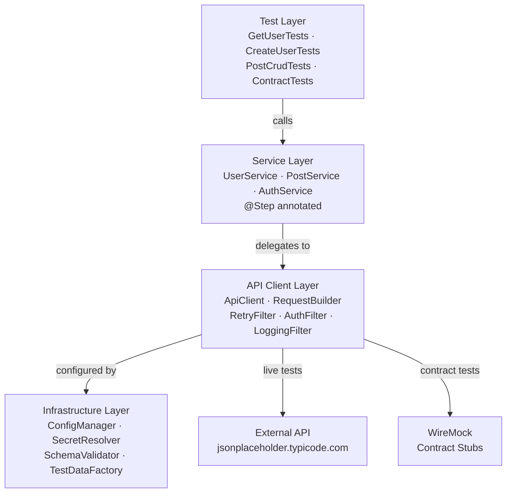
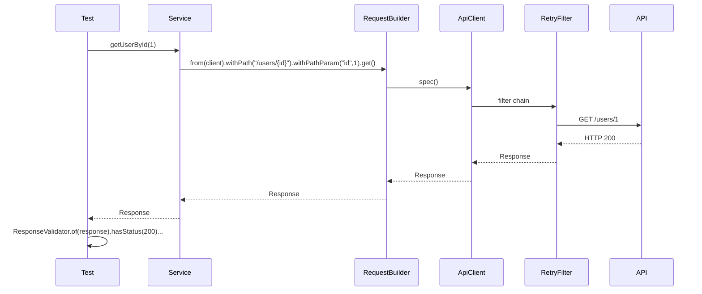

# Architecture Decision Records

## Framework architecture overview

## Request lifecycle

---

## ADR-001: Ports & Adapters architecture

**Status:** Accepted

**Decision:** Tests never call RestAssured directly. All HTTP is behind Service → Client.

**Context:** Naive frameworks couple tests to `given().when().get()`. Any shared pattern (auth, retry, correlation ID) requires touching every test class.

**Consequences:** Tests read as business specifications. HTTP library is swappable. Retry, auth, and logging are framework concerns, not test concerns.

---

## ADR-002: ThreadLocal ApiClient

**Status:** Accepted

**Decision:** `ApiClient` instances stored per-thread in `ThreadLocal`.

**Context:** Parallel test execution creates race conditions on shared mutable HTTP client state.

**Consequences:** Zero race conditions. No synchronisation overhead. Each thread has an isolated client with its own correlation ID and log buffer.

---

## ADR-003: Immutable RequestBuilder

**Status:** Accepted

**Decision:** Every `RequestBuilder` method returns a new instance.

**Context:** A mutable builder passed between parallel threads accumulates state incorrectly.

**Consequences:** Builders are safe to pass around. No defensive copying required at call sites.

---

## ADR-004: JSON Schema validation as first-class assertion

**Status:** Accepted

**Decision:** Every response type has a JSON Schema draft-07 file. Validation called via `ResponseValidator.bodyMatchesSchema()`.

**Context:** Status code assertions confirm the API responded. Schema assertions confirm it responded *correctly* — right field names, types, required fields.

**Consequences:** Breaking API changes (field renamed, type changed, field removed) are caught automatically. Contracts are versioned alongside tests.

---

## ADR-005: Dual reporting

**Status:** Accepted

**Decision:** Allure + ExtentReports run simultaneously on every execution.

**Context:** Allure requires GitHub Pages or a server. ExtentReports produces a self-contained HTML file any stakeholder can open.

**Consequences:** Deep engineering debugging via Allure. Instant stakeholder communication via ExtentReports.

---

## ADR-006: src/main for framework code

**Status:** Accepted

**Decision:** Client, config, services, and utils in `src/main`, not `src/test`.

**Context:** `src/test` classes are not exported in Maven. Multiple test teams cannot share a `src/test` dependency.

**Consequences:** Framework publishable as `com.vinoth.automation:api-automation-core:2.0.0`.

---

## ADR-007: WireMock for contract tests

**Status:** Accepted

**Decision:** Contract tests run against a local WireMock server started per test class.

**Context:** Contract tests must be deterministic and network-independent for CI reliability.

**Consequences:** Contract tests run offline. No external API availability required. Sub-second execution.

---

## ADR-008: RetryAnalyzer on FAILURE only

**Status:** Accepted

**Decision:** `RetryAnalyzer.retry()` checks `result.getStatus() != ITestResult.FAILURE` before retrying.

**Context:** The original RetryAnalyzer retried unconditionally — causing passing tests to be retried 3 times. On the 4th invocation, TestNG's retry path skips `@BeforeMethod`, causing NPE on `userService`.

**Consequences:** Only genuine failures are retried. `@BeforeMethod(alwaysRun = true)` ensures service objects are reinitialised on every invocation including retries.

---

## ADR-009: EXTERNAL_API_SLA_MS constant

**Status:** Accepted

**Decision:** SLA thresholds extracted to named constants per test class.

**Context:** JSONPlaceholder (free public API) regularly responds in 3–6 seconds. A hardcoded `2000ms` threshold causes intermittent CI failures that are not real failures.

**Consequences:** SLA intent is documented. Different thresholds for external vs internal APIs are explicitly named. Reviewers understand why `8000ms` was chosen.

---

## ADR-010: @BeforeMethod(alwaysRun = true, Method method)

**Status:** Accepted

**Decision:** All test classes use `@BeforeMethod(alwaysRun = true)` with `Method method` parameter.

**Context:** TestNG retry path (`IRetryAnalyzer`) reinvokes the test method directly without re-running `@BeforeMethod`. Service objects initialised in `@BeforeMethod` are null on retry invocations.

**Consequences:** Service objects are always reinitialised. `alwaysRun = true` ensures setup runs even in group-filtered executions.